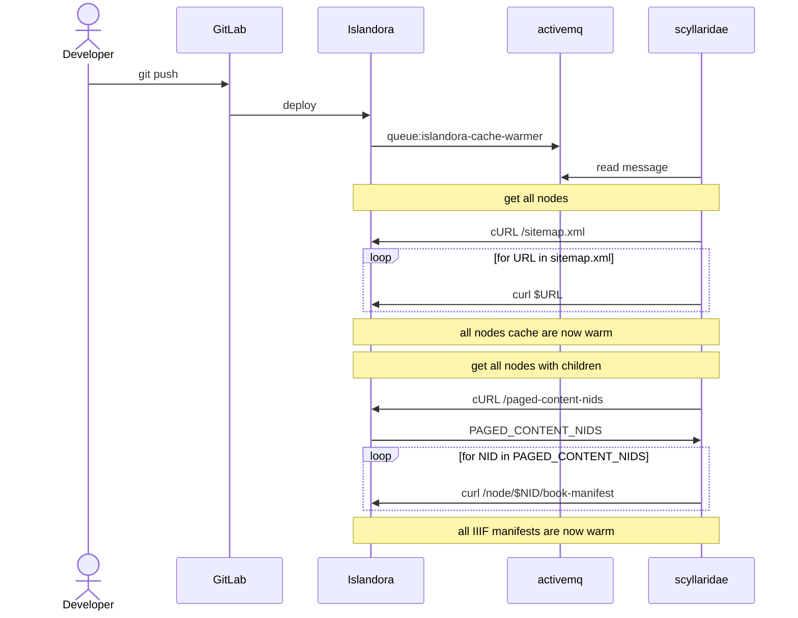
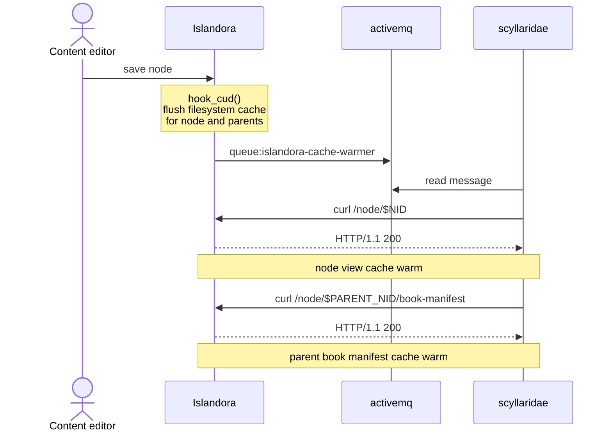

# Cache Warmer

Drupal's internal page cache system is wiped whenever `drush cr` is called. This causes deployments to slow down the site for anonymous viewers.

## Install

Update your docker-compose.yml with

```
    cache-warmer-prod: &cache-warmer-prod
        <<: [*prod, *common]
        image: ${DOCKER_REPOSITORY}/scyllaridae-cache-warmer:main
        environment:
            DRUPAL_URL: "https://${DOMAIN}"
            # when warming the cache, how many nodes to process at once
            NODE_PARALLEL_EXECUTIONS: 5
            # when warming the cache, how many IIIF manifests to process at once
            IIIF_PARALLEL_EXECUTIONS: 3
        depends_on:
            activemq-prod:
                condition: service_started
```

You'd also need an accompanying Drupal module to handle disk caching/invalidation on the Drupal side, which can eventually be broken out of [lehigh-university-libraries/lehigh_islandora](https://github.com/lehigh-university-libraries/lehigh_islandora)

## Decision

Keep the three slowest responses cached on disk to persist beyond cache flushes.

- IIIF book manifests
- Node canonical pages
- Search results

### Deployment

When deployments happen, send an event to cache the entire site



### Node CUD

When a node is CUD, its filesystem cache is wiped from disk and an event is emitted to warm the cache for that node and its parent.



## Rationale

### Traditional

Out of the box Drupal/Islandora's internal page cache is wiped on deployment. This means the site will be slow between the time the deployment happens until the node cache can get warm again. Traditionally, the only way the cache could get warm would be a site visitor visiting the page, which would mean potentially a very poor experience if the page takes a long time to load. Or the cache might get filled by a custom crawler, but to avoid overloading the system that can take several hours to traverse a large site. Which means a larger window for site visitors to have poor experiences.

Traditionally individual item pages are also slow for the initial site visitor when node/media are CUD by a content editor, which flushes the cache for that given entity view after, e.g. an item record has its metadata updated.

### What this service solves

If instead we hold the cache on disk instead of in Drupal's database cache we can invalidate the cache on a per node basis after deployment. This means after a deployment until the cache is invalidated // warmed site visitors will still enjoy a speedy site. Old cached entries will be served until the deployment script can invalidate them and fill the cache with their new version.

We can also emit events on node/media CUD events to have the anonymous view kept warm after entity updates using this same mechanism.

### Other cache solutions considered

Putting Drupal behind a CDN or Varnish is a common pattern for site speed improvements.

A CDN was disqualified since it would require not only additional integration complexity, but also would add additional cost to your site, which we are trying to keep at a minimum.

Varnish was not chosen to avoid the complexity of adding an aditional service to our stack. Adding Varnish would mean needing to configure VCL for the Varnish server and also configuring cache invalidations with something like the Drupal purge module. Instead, it was decided to have the cache handled internally with a custom event subscriber (this is analagous to what varnish would be doing) and `hook_entity_CUD` implementations to keep the cache fresh (instead of the purge module).

This leads to another key decision point why Varnish was not chosen over this custom implementation: Varnish can only really handle variants based on HTTP headers returned by Drupal's response. Since we're implementing the cache within Drupal we have much more flexibility about cache variants and deciding when something can be cached, how it is cached, and when that cache needs invalidated or when it's safe to serve to site visitors. Implementing something like this in Varnish I'm sure could be done, but implementing and debugging would require context switching between php and VCL and massaging HTTP headers to be emitted and received properly by the two languages. This leads back to our original point: this solution reduces the complexity of our tech stack by having the caching logic in Drupal.

## Consequences

Positive:

- Fast page loads for site visitors
- A significantly faster site means resources can be better utilized by other processes
- With our cache invalidation strategy, only the cache warmer service should ever run into a slow page load during the cache invalidation / warming process
- Having the cache logic implemented in Drupal simplifies our tech stack

Negative:

- This is a novel caching implementation with unknown side effects. Though given we're hooking into Drupal's caching system to invalidate cache during CUD events this risk seems fairly low
- Search results could still have slow load times for different faceted/search results. We need to look into other performance improvements in code to speed these up. though less load on the system overall, which this caching strategy affords, should help

## Conclusion

This will be implemented by:

- This scyllaridae microservice
- A Drupal module that handles
  - `hook_node/media_insert/update/delete()` implementations to wipe the cached responses from the filesystem
  - A custom route to get paged content nids
  - An event subscriber to handle caching the responses on disk and invalidating when receiving requests from the microservice
