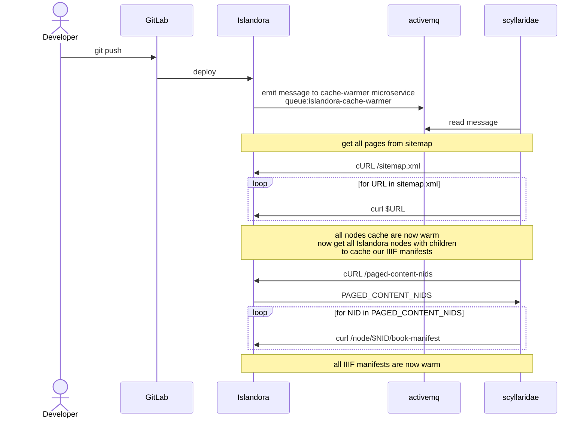
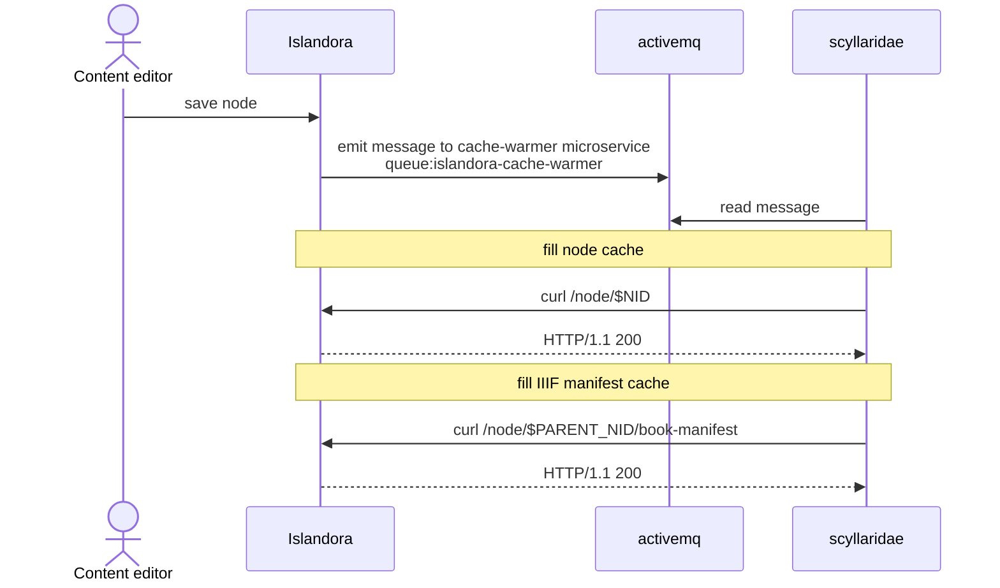

# Cache Warmer

Keep slow Drupal HTML responses cached and fresh.

Islandora/Drupal's internal page cache system is wiped whenever `drush cr` is called. Since deployments require a `drush cr` this results in degraded performance of the site after deployments.

Traditionally, the only way to recover from the degraded state would be a site visitor accessing a given page (which would fill the cache for that page for other site visitors). Waiting for organic hits to fill the cache would likely result in many poor experiences for the first visitor for each page needing filled. Waiting for organic cache fills also means there's a fairly large window for a potential cache stampede if the site were to see a sudden surge of organic traffic after a deployment.

A custom crawler could also be leveraged to help fill the cache after deployment. This would help mitigate site visitors from experiencing slow page loads, but to avoid overloading the system that crawling process can take several hours to traverse a large site. That means a larger time window for site visitors to have poor experiences.

## Solution

Keep the three slowest HTML responses from Drupal cached on disk to persist beyond cache flushes. Only have this service invalidate the responses based on events emitted by Islandora/Drupal this service listens for.

- IIIF book manifests (`/node/\d+/book-manifests`)
- Node canonical pages (`/node/\d+`)
- Search results (on Lehigh's Islandora instance `/browse`)

### Deployment

When code deployments happen, send an event to this service to invalidate/cache the entire site



### Node Created/Updated/Deleted (CUD) events

When a node is CUD, an event is emitted to fill the cache for that node, its parent, and the IIIF manifest.



## Rationale

If we hold the cached responses on disk instead of in Drupal's database cache we can invalidate the cache on a per node basis after deployment. This means after a deployment until the cache is invalidated // warmed site visitors will still enjoy a speedy site. Old cached entries will be served until the deployment script can invalidate them and fill the cache with their new version.

We can also emit events on node/media CUD events to have the anonymous view kept warm after entity updates using this same mechanism.

### Other cache solutions considered

Putting Drupal behind a CDN or Varnish is a common pattern for site speed improvements. In general, both a CDN and Varnish were not chosen to avoid adding additional complexity to [the ISLE stack](https://github.com/Islandora-Devops/islandora-starter-site). The ISLE stack already includes an event driven microservice architecture which we can leverage to keep our caches fresh. If that microservice architecture was not in place, a CDN or Varnish would have been given more serious consideration.

#### CDN

A CDN was disqualified since it would require not only additional integration complexity, but also would add additional cost to your site, which we are trying to keep at a minimum. It also has similar shortcomings related to relying on HTTP headers as detailed further in the below Varnish section.

#### Varnish

Varnish was not chosen to avoid the complexity of adding an additional service to our stack. Adding Varnish would mean needing to configure VCL for the Varnish server and also configuring cache invalidations with something like the Drupal purge module. Instead, it was decided to have the cache handled internally with a custom event subscriber (this is analagous to what varnish would be doing) and `hook_entity_CUD` implementations to keep the cache fresh (instead of the purge module).

This leads to another key decision point why Varnish was not chosen over this custom implementation: Varnish can only really handle cache variants based on HTTP headers returned by Drupal's response. Since we're implementing the cache within Drupal we have much more flexibility about cache variants and deciding when something can be cached, how it is cached, and when that cache needs invalidated or when it's safe to serve to site visitors. Implementing something like this in Varnish I'm sure could be done, but implementing and debugging would require context switching between php and VCL and massaging HTTP headers to be emitted and received properly by the two languages/programs. This leads back to the original point: this solution reduces the complexity of our tech stack by having the caching logic in Drupal.

More to the point: since the caching logic is controlled within Drupal we can cache responses per-user. Effectively making the implementation a private and public cache store.

## Consequences

Positive:

- Fast page loads for site visitors
- A faster site means compute resources can be better utilized by other processes
- With our cache invalidation strategy, only the cache warmer service should ever run into a slow page load during. So a better experience for site visitors
- Having the cache logic implemented in Drupal simplifies our tech stack and codebase
- Since we're caching responses on a per-user basis, we effectively have a single private and public cache store implementation

Negative:

- This is a novel caching implementation with unknown side effects. Though given we're hooking into Drupal's caching system to invalidate cache during CUD events and we're caching per user this risk seems fairly low
- Search results could still have slow load times for different faceted/search results. We need to look into other performance improvements in code to speed these up. though less load on the system overall, which this caching strategy affords, should help
- Stale responses are served for potentially several hours after deployment. We should work further to improve this

## Conclusion

This will be implemented by:

- This scyllaridae microservice
- A Drupal module that handles
  - `hook_node/media_insert/update/delete()` implementations to wipe the cached responses from the filesystem
  - A custom route to get paged content nids
  - An event subscriber to handle caching the responses on disk and invalidating when receiving requests from the microservice

## Install

Update your docker-compose.yml with

```
    cache-warmer-prod: &cache-warmer-prod
        <<: [*prod, *common]
        image: ${DOCKER_REPOSITORY}/scyllaridae-cache-warmer:main
        environment:
            DRUPAL_URL: "https://${DOMAIN}"
            # when warming the cache, how many nodes to process at once
            NODE_PARALLEL_EXECUTIONS: 5
            # when warming the cache, how many IIIF manifests to process at once
            IIIF_PARALLEL_EXECUTIONS: 3
        depends_on:
            activemq-prod:
                condition: service_started
```

You'd also need an accompanying Drupal module to handle disk caching/invalidation on the Drupal side, which can eventually be broken out of [lehigh-university-libraries/lehigh_islandora](https://github.com/lehigh-university-libraries/lehigh_islandora)

## Further work

- [ ] The service that runs the sitewide crawl could be improved by reading response times from the drupal site to inform if more URLs can be crawled in parallel, or if we need to backoff if the response time goes over some threshold
- [ ] We have a lock on the sitewide crawler to avoid multiple instances running at once, but there is no mechanism to restart the crawler if a new deployment occurs during a given run. Currently this is mitigated by just recreating the docker container to kill the process during the rollout so a new crawl can be started fresh
- [ ] More work needs done to ensure CSS/JS asset aggregation creating new asset file names are handled properly
